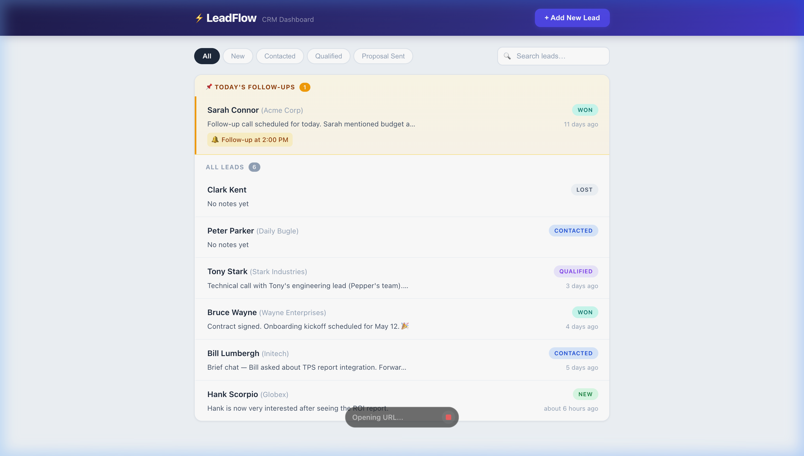
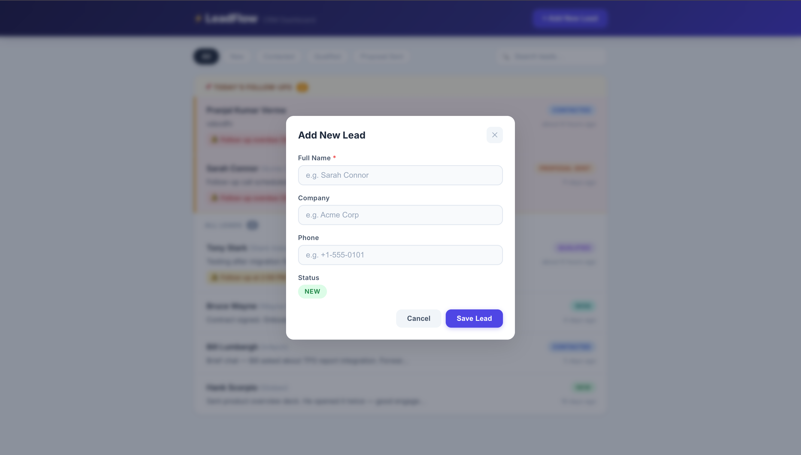
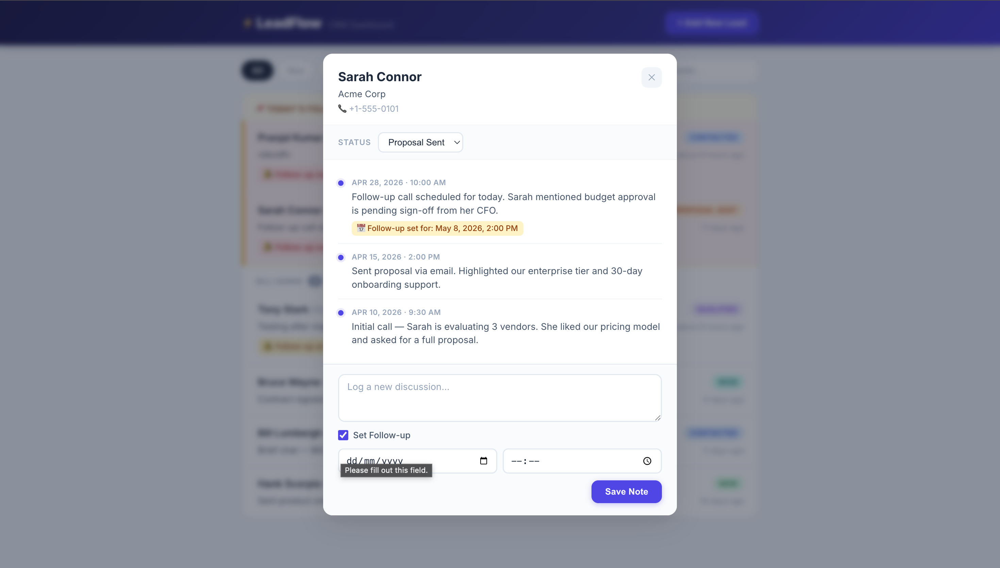

# ⚡ LeadFlow — Lead Management Tool

> **🚀 Live Demo: [https://esmagico-seven.vercel.app/](https://esmagico-seven.vercel.app/)**  
> **🔌 API: [https://es-magico.onrender.com/api/leads](https://es-magico.onrender.com/api/leads)**

A lightweight, full-stack CRM dashboard for managing sales leads, logging discussions, and tracking follow-ups. Built as a single-screen app with a React frontend and Express + Turso (cloud SQLite) backend. Leads are sorted with today's follow-ups pinned to the top, overdue items highlighted, and status changes applied optimistically for a snappy user experience.

---

## Tech Stack

| Layer | Technology |
|-------|-----------|
| **Backend** | Node.js, Express, [@libsql/client](https://github.com/tursodatabase/libsql-client-ts) |
| **Database** | [Turso](https://turso.tech/) (cloud SQLite — free tier) |
| **Frontend** | React 19, Vite 8 |
| **Hosting** | Vercel (frontend) + Render (backend) |
| **Testing** | Jest + Supertest (backend), Vitest + React Testing Library (frontend) |
| **Utilities** | date-fns (time formatting) |

---

## Prerequisites

- **Node.js** ≥ 18 (tested on v20)
- **npm** ≥ 9

---

## Setup

### 1. Clone the repository

```bash
git clone https://github.com/pran-ekaiva006/-Es-Magico.git
cd -Es-Magico
```

### 2. Backend

```bash
cd backend
npm install
```

Create a `.env` file inside the `backend/` folder:
```env
PORT=3001
TURSO_DATABASE_URL=your_turso_database_url
TURSO_AUTH_TOKEN=your_turso_auth_token
```

> Get your Turso credentials by running: `turso db show <dbname>` and `turso db tokens create <dbname>`

```bash
npm run seed               # Populate Turso DB with sample leads & discussions
npm start                  # Production: node src/index.js
# or
npm run dev                # Dev mode with --watch auto-reload
```

The API will be available at **http://localhost:3001**.

### 3. Frontend

```bash
cd frontend
npm install
npm run dev
```

Open **http://localhost:5173**.

---

## Running Tests

### Backend (14 tests — Jest + Supertest, in-memory SQLite)

```bash
cd backend
npm test
```

### Frontend (14 tests — Vitest + React Testing Library)

```bash
cd frontend
npm test
```

---

## API Endpoints

| Method | Route | Description |
|--------|-------|-------------|
| `GET` | `/api/leads` | List leads (optional `?status=` and `?search=` filters) |
| `POST` | `/api/leads` | Create a new lead |
| `PATCH` | `/api/leads/:id/status` | Update lead status |
| `GET` | `/api/leads/:id/discussions` | Get discussions for a lead (sorted DESC) |
| `POST` | `/api/leads/:id/discussions` | Add a discussion note (optionally sets follow-up) |

---

## Features

### Core

- **Lead list with status badges** — colour-coded pills (New → green, Contacted → blue, Qualified → purple, Proposal Sent → orange, Won → teal, Lost → gray)
- **Add new lead modal** — name (required), company, phone with real-time validation
- **Lead timeline dialog** — view/add discussion notes, change status, set follow-up dates
- **Filter by status** — pill buttons: All / New / Contacted / Qualified / Proposal Sent
- **Search leads by name** — debounced (300 ms) with clear button and contextual empty state

### Bonus / UX Polish

- **📌 Pinned follow-ups** — today's follow-ups are pinned at the top of the list with a highlighted section
- **🔴 Overdue highlighting** — past-due follow-ups get a red left border
- **⚡ Optimistic status updates** — status badge updates instantly in the list; auto-reverts on API failure
- **💀 Skeleton loader** — shimmer animation while leads are loading (no layout shift)
- **🔔 Error toast** — fixed top banner with auto-dismiss (4 s) for any API failure
- **🔄 Atomic follow-up sync** — setting a follow-up on a discussion atomically updates the lead record in a single transaction
- **📐 Responsive layout** — 760 px centered card, collapses gracefully on mobile
- **🧪 Full test coverage** — 28 tests across backend (14) and frontend (14)
- **🗄️ Safe migrations** — `ALTER TABLE` migration handles existing DBs that pre-date schema changes
- **☁️ Cloud deployment** — Frontend on Vercel, Backend on Render, Database on Turso (all free tier)

---

## Screenshots

### Dashboard — Lead List with Pinned Follow-ups



The main view shows all leads with status badges, time-ago timestamps, and today's follow-ups pinned at the top in a highlighted section. Overdue follow-ups are marked with a red left border.

### Add New Lead Modal



A clean modal overlay for creating new leads with required name validation, optional company and phone fields, and the default "New" status badge.

### Lead Timeline Dialog



Click any lead to open the timeline dialog showing the full discussion history in reverse chronological order. Change the status via dropdown, log new notes, and optionally set follow-up dates — all within the same dialog.

---

## Project Structure

```
├── backend/
│   ├── src/
│   │   ├── index.js          # Server entry point
│   │   ├── app.js            # Express app factory
│   │   ├── db.js             # Turso/libsql connection + migrations
│   │   ├── seed.js           # Sample data seeder (runs against Turso)
│   │   ├── routes/
│   │   │   └── leads.js      # All API routes (async)
│   │   └── __tests__/
│   │       ├── setup.js      # Local file DB for tests
│   │       └── leads.test.js # 14 integration tests
│   ├── .env                   # TURSO_DATABASE_URL + TURSO_AUTH_TOKEN (gitignored)
│   └── package.json
│
├── frontend/
│   ├── src/
│   │   ├── App.jsx           # Main layout + state
│   │   ├── App.css           # Layout styles
│   │   ├── api.js            # Fetch wrapper for all endpoints
│   │   ├── index.css         # Design tokens + reset
│   │   ├── components/
│   │   │   ├── LeadList.jsx / .css
│   │   │   ├── AddLeadModal.jsx / .css
│   │   │   └── LeadTimelineDialog.jsx / .css
│   │   └── __tests__/
│   │       ├── setup.js
│   │       ├── LeadList.test.jsx
│   │       ├── AddLeadModal.test.jsx
│   │       └── LeadTimelineDialog.test.jsx
│   ├── vite.config.js
│   └── package.json
│
├── docs/screenshots/          # App screenshots
└── README.md
```

---

## License

MIT
